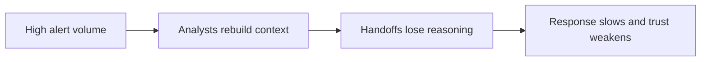
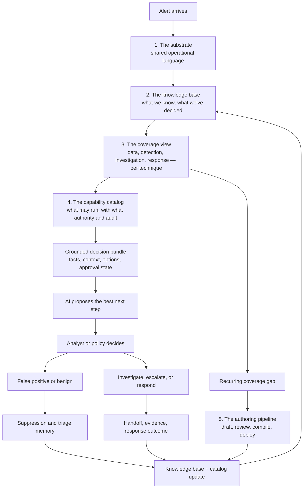
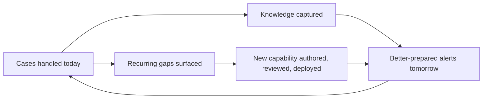
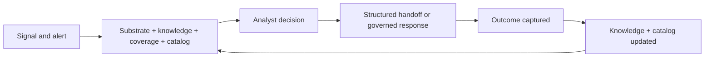

# The Learning SOC: A Framework for Security Operations That Improve Through Use

**Warlog Whitepaper Series: Foundational Paper**
*April 2026*

---

## Reading This Paper

Three readers should find themselves in this paper, with different stakes:

- **Analysts and senior responders** — does this make daily work better, worse, or just different?
- **SOC managers and team leads** — can it be trusted in production, and how does it scale as the team and the alert mix grow?
- **Heads of security and CXOs** — what is a defensible position on AI in security operations that is neither hype-driven nor reflexively conservative?

The model addresses the three concerns through one mechanism. Where the difference matters, the paper says so.

---

## Abstract

Autonomy without memory is not progress. It is faster forgetting.

The dominant industry response to alert fatigue has been speed: systems that suppress, classify, and act with less analyst involvement. This paper argues for a different optimization. A SOC's hardest problem is not how many alerts it can process per hour — it is how much of what it learns each hour survives into the next one. The Learning SOC is an operating model in which analyst decisions, escalation reasoning, response outcomes, and recurring shortfalls all become reusable operational knowledge. The mechanism for that reuse is engineering, not discipline: the model aims to achieve institutional memory through passive capture of analyst intent during triage rather than through end-of-case reporting that operators tend to bypass under load — the act of working a case is itself the act of capture, with the trace preserved in typed, governed form and refined into doctrine through convergence rather than ingestion. The model is designed to improve prioritization, strengthen escalations, keep response actions inside clear approval boundaries, and feed outcomes back into detections, playbooks, and guidance — without replacing the existing stack and without requiring the team to trust a black box. The paper describes the operating mechanism, the failure modes of the alternative, the cost and addressable scope of adoption, and a small set of questions a buyer can use in 2026 to test any vendor's claims.

This paper proposes an architectural model based on three years of design and implementation work. Empirical validation through Design Partner deployments begins in Q3 2026; the claims that follow should be read as a defensible target architecture and a buyer-side framework, not as benchmarked performance data.

## Why This Matters

- Analysts spend less time rebuilding context and repeating the same checks.
- Escalations carry usable reasoning, not just status.
- Automation becomes easier to trust because recommendation and execution are clearly separated, and every executed action is reconstructable from its evidence.
- Leadership gains a measurable record of how the team's operational capability grew between quarters, traceable to the cases that drove it.

---

## 1. The Problem Behind the Queue

Security operations is usually described as a volume problem. That is true, but it is not the whole problem. The more damaging issue is fragmentation.

Alerts arrive in one system, context sits in another, analyst notes live somewhere else, escalations become short summaries, and response coordination often moves into chat or ticket threads. The result is a queue that looks like a workload problem from the outside, but feels like a continuity problem on the inside.

Analysts pay the price first. They spend time reassembling context the organization has already produced before. Senior analysts pay it again when escalations arrive without the discarded hypotheses, verification steps, or open questions that shaped earlier work. Leaders pay it at a different level: response is slower to trust, audit trails are thinner than they should be, and automation remains constrained because the organization cannot always explain why the system is confident enough to act.

Many programs try to solve this with more automation alone. That can improve speed, but it does not automatically improve coherence. If reasoning is still lost at triage, handoff, and response boundaries, faster processing simply creates faster repetition of the same work.

The practical bottleneck is the interval between alert assignment and defensible decision. That interval grows with context assembly, evidence checking, hypothesis testing, and documenting what was learned. Traditional performance metrics do not fully expose this cost, which is why many teams underinvest in the handoff and reasoning layer even though that is where a large part of analyst time is actually consumed.

The strategic question is therefore not only "how do we process more alerts?" It is also "how do we make each handled alert reduce the cost of the next correct decision?"

---

## 2. What Learning Means in a SOC

In this paper, learning does not mean generic AI improvement or another promise of autonomy. A SOC learns when a decision made today improves the quality, speed, or confidence of a similar decision tomorrow in the same environment.

That definition matters because it changes what the system should optimize for.

| Dimension | Autonomous SOC | Learning SOC |
|---|---|---|
| Primary aim | Reduce human touches | Improve the quality and reuse of decisions |
| Role of AI | Decide and act faster | Propose, explain, and prioritize |
| Role of analyst | Exception reviewer | Decision owner |
| Handoff model | Summary of outcome | Preservation of reasoning and open questions |
| Long-term value | Throughput | Institutional knowledge |
| What grows over time | Closure rate | The team's operational repertoire |

An analyst's false-positive verdict should not disappear into a closed ticket. An escalation should not force the next person to rediscover what was already checked. A response recommendation should not arrive without a visible basis. A Learning SOC exists when these gaps are closed by design rather than by individual heroics.

Throughput-only optimization tends to reduce visible workload without reducing analytical uncertainty. If a signal is suppressed without the reasoning being preserved, the ambiguity returns later. If an escalation carries only a conclusion, the next tier repeats the work. If automation can act but not explain itself, adoption stalls precisely at the point of highest consequence.

The next section describes the mechanism, layer by layer, on a real and difficult alert.

---

## 3. How the SOC Actually Learns

### 3.0 A concrete starting point

Tuesday morning. A monitoring rule fires on a privileged service principal — let's call it `crm-sync` — making Microsoft Graph API calls with the `Mail.Read` scope from an autonomous system the principal has never used before. Concurrently, three users in the finance team have just received OAuth consent prompts for a third-party application; the application's vendor is real, but the redirect URI is on a domain registered six days ago. A fourth user has, in the past 90 minutes, created an inbox forwarding rule to an external address.

This is the kind of alert that exposes the difference between operating models.

An autonomous-leaning platform faces a hard choice with no good answer in either direction. Suppress as low confidence — each individual signal is weak — and the chain goes unhandled. Auto-respond — disable the service principal, revoke the OAuth grants, force reauth — and the next morning the sales pipeline is broken, the finance team is locked out of mailboxes they actually need, and the security team owns a business-impact incident of its own creation.

A traditional SOC analyst, given this alert raw, will spend an hour or more opening tabs: identity logs in the cloud IdP, mailbox audit, the third-party application catalog, threat intelligence on the new domain, the consent grant history, the service principal's normal ASN footprint, the inbox rule audit. Most of that hour is not investigation. It is reassembly of material the organization has often produced before, on similar cases, that is now scattered across systems.

In the target model, the arrival moment looks different. The same alert would land with: the prior consent-grant-attack cases the team has handled, the team's doctrine on third-party application vetting, the technique framing for OAuth abuse and credential phishing, the four-question coverage view for these techniques (do we have the data, the detection, the investigation path, the response actions?), and the response options that *may* run — each one tagged by reversibility, evidence, business impact, and approval requirement. The analyst's first read should be a *decision read*, not a *context-assembly read*.

A clarification worth making early. The bundle that holds all of this material is a typed object — the input to AI reasoning and the payload of the audit trail. The analyst does not read the bundle as a wall of text. The interface presents a staged view: headline, recommended next step with one-line evidence, and progressive disclosure for facts, alternatives, and supporting context. Reducing context-assembly cost is not the same as dumping all context at once. A platform that presents the bundle as a flat dump has solved the data problem and recreated the cognitive problem.

That arrival moment is not magic. It is the visible output of five components operating together. Section 3 describes them in turn, then walks the same case through them end to end.

### The five components

The order matters. The substrate makes the language. Knowledge gives the framing. Coverage shows what we can see and investigate. The catalog shows what we can run, with whose authority. The decision happens inside those boundaries. Recurring shortfalls become structured input for new capability. And every outcome — verdict, handoff, executed action, new capability — writes back into knowledge or catalog so the next case starts further along.

### 3.1 The Substrate: One Shared Operational Language

A SOC never reasons from one tool alone. Alerts, asset context, identity context, prior cases, threat intelligence, and workflow state all arrive in different formats. Before anything else, the platform translates that heterogeneity into a small, stable vocabulary for the things the workflow actually depends on: the alert itself, the affected entities, the observables, the technique candidates, the evidence, the case state, the proposed next steps, and the approved actions.

Just as important, this language keeps four kinds of content separate inside the same decision object:

- **observed facts** — what the telemetry says
- **contextual material** — what enrichment and prior cases bring
- **proposed judgments or actions** — what the system or analyst is suggesting
- **approved workflow truth** — what has been decided and recorded

This separation is what keeps AI assistance grounded. Instead of receiving a flat prompt where logs, prior notes, guesses, and execution state are mixed together, the model reads a bounded decision object with clear semantics. That reduces hallucination risk at the architecture level, not by prompting alone, and it gives the analyst, the auditor, and the system the same mental model of what is fact, what is hypothesis, and what is decided.

For the analyst, the practical effect is that an "AI-suggested next step" never appears next to a fact without a visible link to the evidence it relied on. For the manager, the audit trail records what was *proposed* as well as what was *decided*, not only what was *done*.

The substrate by itself does nothing useful. It is the precondition for everything that follows.

### 3.2 The Knowledge Base: What This Organization Has Learned

The knowledge base is the part of the system that holds what the organization knows. It is distinct from the queue of live work and from the catalog of running tools.

It holds three kinds of content, with the same governance lifecycle but different roles:

- **Incident knowledge** — narratives, observations, and analyst notes captured from real cases as they close. The team's institutional memory.
- **Doctrinal knowledge** — validated rules of practice: correlation patterns, suppression policies, threshold rules, escalation logic. *How we handle this kind of case here.*
- **Reference knowledge** — structured technique-level knowledge (typically MITRE-aligned), the defensive moves that counter each technique, the weaknesses it commonly exploits, the mitigations the organization has previously chosen to favor.

Every article moves through a governed lifecycle: drafted, reviewed, validated, eventually archived. Provenance is tracked: an article authored by an analyst is treated differently from one drafted by AI from a coverage gap, even if both end up validated. This is what makes the memory trustworthy over time — not who wrote it, but the visibility of how it became authoritative.

When an alert arrives, the substrate pulls from this base the material that frames the case. For the OAuth anomaly above: the prior consent-grant attack cases the team has handled (often with a chain that looks like *new app + unusual scope + new ASN + forwarding rule*), the team's doctrine on third-party application vetting, the technique framing for OAuth-based credential and data access. This is not an AI summary of the open internet. It is the organization's own framing of the threat, in its own language, reusable across cases.

This is what allows AI assistance to stay specific. Generic security advice degrades the moment it meets enterprise reality. Advice anchored in the organization's own knowledge does not.

For the analyst, the knowledge base is what makes the alert arrive *prepared*. For the manager, it is what makes the team's accumulated experience survive turnover.

### 3.3 The Coverage View: What We Can See and Investigate, Per Technique

Knowledge tells the system what we know about a kind of attack. The coverage view tells the system whether the SOC is actually equipped to act on it, technique by technique.

For each technique on the attack surface, the platform tracks four operational questions:

- **Data** — do we have the telemetry sources required to confirm or rule out this technique in this environment?
- **Detection** — do we have rules or analytics that fire on this technique, with what confidence?
- **Investigation** — do we have a structured investigation path the analyst can follow next?
- **Response** — do we have an approved containment or remediation action mapped to the impact this technique tends to produce?

For a single alert, these four questions constrain what AI may propose: the system cannot recommend pivoting on a data source the organization does not collect, or running an investigation step the team has not adopted. The proposal is bounded by reality, not by what the model would *like* to do.

For the program as a whole, the same four-dimensional view becomes a continuously updated coverage map at the technique level. Every resolved case, new detection, new playbook, or new integration changes the picture. Every alert that lands on a technique with weak coverage is immediately visible — both as a constraint on the current decision and as a signal that something is missing.

That second use is what turns the coverage view from documentation into an operating instrument. Gaps are not tracked in a separate spreadsheet that nobody reads; they are first-class signals that flow into the improvement loop described in section 3.6.

For the manager, this is the layer that answers "what can my team actually do today, against what we are actually being attacked with?" — without an off-cycle audit.

### 3.4 The Capability Catalog: What May Actually Run, With What Authority

Coverage tells the system what kinds of behaviors the team is equipped to address. The capability catalog tells the system what may actually be executed in production, against this organization, today, and under what authority.

Every action the platform can take is classified by reversibility:

- **Read-only** actions — lookups, enrichments, indicator queries. Activated automatically when the underlying integration is installed. No friction on safe operations.
- **Reversible** actions — a temporary block, a ticket creation, a quarantine, a session revocation. Land as proposals an admin reviews before they become available, and may run automatically only under explicit conditions.
- **Destructive** actions — host containment, account disablement, OAuth grant revocation, file removal, force-reauth-org-wide. Always gated by approval at the moment of execution, unless an explicit and time-bound fast-path policy applies (for example, declared ransomware response under a defined window).

Reversibility is necessary but not sufficient. In regulated or high-availability environments, an action that is technically reversible at the security layer can still be operationally destructive at the business layer: revoking the OAuth tokens of a production sync service is reversible in the sense that new tokens can be issued, but the four hours of broken downstream synchronization, the reconciliation work, and the regulatory reporting window that opens during the gap are not. The catalog therefore carries a second axis on each binding — **business impact** — and treats reversibility alone as insufficient gating in any environment where service-level commitments are part of the security perimeter (finance, healthcare, industrial control, regulated SaaS).

The right architectural question on business impact is *who specifies it*, and the wrong answer is *the SOC team, per binding, before deployment*. An organization with four thousand applications cannot populate impact metadata for every binding by hand without either marking everything HIGH (collapsing the catalog into universal approval friction and destroying the value of tiering) or never finishing the population (leaving the catalog effectively unbound). Business impact must therefore be inherited from existing organizational governance, not recreated inside the security platform.

The realistic state of that governance has to be acknowledged. CMDB hygiene is, in practice, a mixed picture in nearly every large organization. What is usually solid: production-tier asset registers maintained under regulatory audit, IAM groups for privileged identities, cloud account boundaries (prod / staging / dev), critical-asset registers maintained by the CISO office for regulated data and high-stakes systems. What is usually a mess: the long tail of mid-tier business applications, ordinary user identity attributes, resource tagging on non-production, anything that has been growing for more than ten years. The platform must work with this asymmetry, not pretend it does not exist.

The deployment pattern reflects that. At install, the organization tells the platform which sources to trust — the CISO office knows which parts of the CMDB are clean and which are decorative — and the platform reads impact signals only from those sources: the trusted CMDB tiers, cloud resource tags (`Criticality: high`, `Environment: prod`, `Compliance: pci`), IdP group membership, regulated-data registers, change-management blast-radius classifications. Where those signals are present, the binding inherits its impact tier from the source of truth the organization already audits.

Where they are absent — and on a real CMDB they will be absent for a meaningful fraction of assets — the platform does not collapse to universal HIGH and paralyze the catalog. It defaults to a *workable mid-tier* (treat as approval-required for destructive actions, delegated for reversible non-destructive actions), and refines through just-in-time clarification: the first time a non-trivial action is proposed against a previously-unclassified asset, the platform asks the responsible owner once, with a one-click classification interaction, persists the answer to the binding, and reuses it from then on. Impact metadata is not a setup task and is not a CMDB-cleanup project. It is an asset that grows from cases — the same flywheel principle that governs the rest of the model.

The approval policy then considers both axes. *Reversible + low impact* may be delegated. *Reversible + high impact* requires approval at the moment of use even though the underlying action is reversible. *Destructive + critical impact* requires approval and a named business co-signer. The platform does not invent the impact classification, does not ask the SOC team to recreate the organization's governance, and does not require the org to clean ten years of CMDB debt before deployment — it reads the signals the org has, falls back to a workable default where it does not, and accumulates clarity through use.

The catalog keeps four facets together because they answer four different questions managers and auditors actually ask:

- *What capabilities exist in principle?* — the catalog of what the platform can offer.
- *What is wired up for us, and in what state?* — bindings: active, awaiting approval, disabled.
- *Who may run what, and under what conditions?* — the approval policy, by reversibility tier and delegation rule.
- *What was actually run, by whom, on what evidence?* — the execution audit, joined to the case that triggered it.

Two consequences follow.

First, when AI proposes a next step, it cannot propose anything outside the catalog. The recommendation surface is bounded by what the organization has actually approved. A model cannot suggest "isolate this host" if no isolation capability is bound, and cannot silently execute a destructive action that has not been approved.

Second, every executed capability — whether triggered from a playbook step, a handoff automation, or a manual operator command — uses the same execution path and produces one consistent audit row. That is what allows automation to scale without losing accountability.

For the analyst, the catalog is what makes the proposed action come with its risk level, its evidence, and its approval requirement *attached*. For the head of security, it is what makes the answer to *"could the platform have done X without anyone knowing?"* structurally **no**.

### 3.5 The Decision Loop: Walking the OAuth Anomaly Through

Return to the OAuth anomaly from §3.0. Here is what the same alert looks like passing through the four layers above.

**Substrate.** The alert is normalized into one decision object: the service principal `crm-sync`, the new ASN, the three consent-grant events on the finance users, the new third-party application identity, the redirect domain, the inbox forwarding rule. Facts, context, and any pre-existing system suggestions are tagged separately so nothing gets confused with anything else.

**Knowledge.** The base contributes prior consent-grant-attack cases the team has closed (with the recurring chain shape), the team's doctrine on third-party application vetting (any new third-party app touching mail scopes requires explicit vetting before grant), and the reference framing for OAuth abuse, mailbox forwarding rule abuse, and Cloud Account Discovery — including the typical follow-up techniques (data exfiltration via mailbox sync, lateral OAuth grants).

**Coverage.** For OAuth abuse and mailbox-rule manipulation in this environment: data is present (cloud IdP audit, Graph API logs, mailbox audit), detection has fired on two of the three signals, an investigation path exists for *consent-grant chain investigation*, and four response actions are mapped — block the third-party application via Conditional Access (reversible), revoke OAuth tokens for that application (reversible), disable `crm-sync` (destructive — and known to break the sales pipeline), force re-authentication on affected users (destructive with business impact). One coverage shortfall is also flagged: the team has no automated detection for *new redirect domains under 14 days old* on consent grants, which would have raised confidence on this case earlier.

**Catalog.** Of the four response actions: enrichment of the new domain via threat intel sources is read-only and runs automatically. Blocking the application via Conditional Access is reversible and is delegated to L2 under conditions met here (multi-signal chain present). Revoking OAuth tokens for the application is reversible, also delegated. Disabling `crm-sync` is destructive — explicit approval required, with the business impact warning attached. Force-reauth org-wide is destructive — same.

**Decision.** In the target model, the system assembles the bundle: facts, context, technique framing, four proposed next steps with their evidence, reversibility, and approval state. AI proposes a sequence — *block the application via Conditional Access, revoke OAuth tokens for the application, do not disable `crm-sync` yet, escalate to L2 for the consent-grant chain investigation, surface the missing detection on new redirect domains as a coverage gap.* The analyst reviews — agrees on the application block and token revocation, approves the L2 escalation with the bundle attached, accepts the gap surfacing — and executes. Each action runs through the same execution path, audited against this case.

What did *not* happen: the analyst did not spend an hour opening tabs. The system did not auto-disable a service principal whose disablement would have caused a business outage. The reasoning that led to "block and revoke but do not disable yet" was captured, not just the outcome. The L2 inheriting the case has the full bundle — including the discarded option to disable and the reason it was discarded. If a similar chain shape returns next month, the next analyst inherits all of this, not just a closed ticket.

### 3.6 The Authoring Pipeline: When the Loop Builds Its Own Capability

The most differentiated part of the model begins when the system sees a recurring shortfall — not just one case.

In the OAuth case above, one coverage gap was surfaced: no automated detection for *new redirect domains under 14 days old* on consent grants. Suppose two more consent-grant cases in the next two weeks expose the same gap. Suppose investigation steps that no template currently supports keep being repeated by hand. Suppose a related telemetry source — third-party application telemetry from a vendor the SOC depends on — keeps coming up as missing context.

These are not three separate problems. They are one signal: the operating repertoire is missing something the team's actual work would benefit from.

In a traditional SOC, that signal becomes an informal complaint, a backlog ticket, a quarterly engineering project, or — most often — nothing at all. In a Learning SOC, the signal is captured as a structured proposal as soon as it is recognized, *while the operational context that motivates it is still attached to the cases that exposed it*.

The proposal then enters a governed authoring path. AI drafts the new content — a detection rule, an investigation template, a playbook, a connector to a missing data source — but it does not write free-form code. It produces a structured manifest from a constrained vocabulary, and a deterministic engine compiles that manifest into the executable artifact. This separation is intentional and load-bearing: the model contributes intent and shape; the compilation step contributes safety. The output is reviewable as a manifest, dry-runnable before approval, and inert on disk until an admin approves it.

Two clarifications matter, because the manifest layer is often misread.

First, manifest review is an admin or security-engineer event, on the order of weekly or monthly when new capability is being authored. It is not an analyst event during daily case work. Analysts never read manifests; they receive the compiled artifact — a playbook step, a detection rule, an investigation template — already integrated into the decision loop.

Second, the delivery surface is a Git pull request, not a Warlog-specific review interface. The authoring pipeline writes manifests to a repository the organization controls, opens a PR, runs the dry-run as a CI check on representative cases, and the capability deploys on merge after human review. The reviewer uses the same surface they already use for infrastructure-as-code: the same diff view, the same comment threads, the same approval policy, the same revert-on-mistake guarantees, the same git history showing who authored what and when. The platform contributes the manifest grammar, the deterministic compilation, and the dry-run; the organization contributes the review culture it already runs.

A clarification on who reviews — because this is the point most often misread, and where the GitOps surface is sometimes dismissed as "asks every analyst to be a developer." It does not. The PR review is the work of the role the organization already calls *detection engineer*, *SOC engineer*, *security automation lead*, or *platform owner* — the role that already maintains the team's Sigma rule library, the SOAR playbook repository, or the integration codebase. This role is common in regulated banks under DORA / NIS2 change-management requirements, in mature MSSPs, and in scale-ups with a DevSecOps culture. The L1 and L2 analysts working alerts do not touch Git; they receive the compiled artifact integrated into the workflow. The bar is *"there is someone in the org who can review a detection PR"*, not *"every analyst is a developer"*. For high-impact capability classes (new destructive actions, new connectors with broad scopes), the binding can require co-review by two named approvers; for low-impact classes (a new investigation template that only reads), single-reviewer approval is appropriate.

This is intentional on two grounds — it removes the need to invent (and train people on) a proprietary review interface, and it inherits all the governance properties the organization already enforces on its IaC repository (branch protection, required reviewers, signed commits, audit log).

The alternative — AI emitting free-form Python or shell scripts that deploy through a proprietary review interface nobody else uses — is not faster, it is just unaudited and unportable. Most "agentic SOC" pitches conceal that they take exactly that alternative; the failure mode in §3.8 ("the hallucinated indicator") is the symptom of doing so.

A human reviews the proposal, with the originating cases still linked to it. If accepted, the new capability joins the catalog (or the coverage map, depending on what was created), bindings are created or proposed, and the next time a similar case appears, the bundle that AI receives includes the new capability as an available option. The organization's repertoire has grown, with traceable provenance from the cases that exposed the gap to the manifest that defines the new behavior.

For the analyst, this is what closes the gap between "I keep hitting this problem" and "the problem is now handled by default." For the manager, it is what turns the team's daily work into a capability roadmap that builds itself out of real evidence rather than from a vendor's release notes.

### 3.7 Why the Flywheel Holds Together

Each layer above is necessary, but the value is in the loop, not the parts.

- The **substrate** makes the language stable enough that knowledge, coverage, capability, and decisions can refer to the same things.
- The **knowledge base** makes outcomes durable, so a decision today informs decisions tomorrow.
- The **coverage view** makes the gap between intent and reality visible in real time, not at audit time.
- The **catalog** makes execution governable, so automation can grow without losing accountability.
- The **authoring pipeline** makes the loop self-extending: when the team hits the edge of its current capability, the system writes a draft, the team reviews, and the edge moves.

Every closed case can write to the knowledge base. Every recurring shortfall can write to the catalog. The next alert benefits from both. That is the flywheel. It is not "AI gets smarter on its own." It is "the team's own work compounds, by design, in places the team controls."

### 3.8 What Autonomous SOC Pitches Don't Survive in Production

The dominant alternative to this model is the *autonomous SOC* pitch — AI that triages, decides, and acts at scale, with humans relegated to oversight. The pitch demos well. It survives less well in production. Five failure modes appear consistently, and any team evaluating an AI-led SOC platform should know how to look for them.

**1. The pre-cleaned demo.** Vendor demos run on alerts where the investigation context is already clean: the asset taxonomy is healthy, the identity graph is up to date, the logs are complete, the technique mapping is settled. In production, the same automation hits ambiguous identity, missing asset records, partial logs, contested ownership. Within months — sometimes weeks — the "autonomous" system tends to degrade toward *decision support*: useful, but typically less than what was sold.

**2. The opaque action.** Autonomous suppression closes a large fraction of alerts; the audit log records "AI verdict: benign" with a reasoning blob attached. Three months later, an incident is traced to one of those suppressions. Nobody can reconstruct the decision boundary that justified it. The organization owns the consequence without owning the decision.

**3. The hallucinated indicator.** LLM-driven enrichment occasionally produces an indicator or attribution that was never in any feed — invented attribution to a known threat group, invented IOC linkage, invented protocol behavior. The hallucination becomes a verdict. The verdict becomes an action. The action affects production. Detection of this failure mode is itself difficult precisely because the output reads as plausible.

**4. Throughput without coverage.** Closure rate goes up; the techniques the SOC actually covers do not change. A new technique appears in the wild. The closure machine has no signal for it. Dashboards continue to look healthy even as the operational posture stagnates. The organization is faster at handling what it already handled, and not at all faster at handling what it did not.

**5. The fast path becomes the only path.** An "approval boundary" exists in the architecture, but in practice approvers rubber-stamp because the volume is too high to review carefully. Over time, the approval gate can become theater. Destructive actions effectively run on autopilot. No one realizes until the first wrong one.

A Learning SOC is not immune to these by name; it is structurally resistant by construction. The substrate keeps facts and inferences distinct, so hallucinated material is visible as an inference without evidence. The catalog ties every action to the evidence and the case, so opaque action becomes structurally hard. The coverage view exposes posture growth or stagnation independently of closure rate. Approval is bound to reversibility tier rather than to volume tolerance. None of these properties is a marketing claim — each one is a structural choice, visible in the audit trail, that would have to be deliberately defeated.

For a team evaluating any platform that claims AI-led security operations: ask to see the production audit log, not the demo. The five failure modes above leave traces — or they don't.

---

## 4. What Changes in Practice

The Learning SOC is credible only if practitioners can recognize it in daily work. Five changes matter most, each traceable to a specific layer above. The fifth is about adoption cost, which is rarely discussed honestly elsewhere.

### 4.1 Alerts Arrive Better Prepared

The goal is not to auto-close everything. The goal is to reduce avoidable setup work.

When an alert appears, the analyst should not need to begin from a raw event alone. Relevant context should already be assembled around it: prior related activity, asset criticality, identity context, threat intelligence, the technique framing pulled from the knowledge base, and a clear summary of what the system believes is worth checking next. The substrate keeps observed facts separate from inferred conclusions and from recommended actions, so an analyst sees at a glance which is which.

That distinction is what makes AI assistance reviewable. If a recommendation cannot show what it relied on, it is not operationally useful even when it sounds plausible.

The visible test for an analyst: the first thirty seconds of opening an alert should already point at a defensible next step, not at "open the next tab."

### 4.2 Triage and Escalation Become More Structured

In most SOCs, the costly delay is not only time to detect. It is time to understand.

That delay grows when different alert categories are handled through the same loose workflow. A Learning SOC uses category-aware guidance, required fields for key verification steps, and escalation thresholds that prevent low-quality handoffs from simply moving incomplete work upstream.

This is not about forcing analysts into rigid scripts. It is about ensuring that important reasoning survives the transition. A useful handoff preserves findings, evidence, discarded hypotheses, and unresolved questions. Without that, an escalation is often just a status change with hidden rework attached.

Standard SOC metrics — Mean Time to Detect, Mean Time to Respond — do not capture this cost, and any single time-based metric proposed as a replacement (Mean Time to Understand, for instance) is contaminated by the analyst's parallel work, breaks, and meeting interruptions; treating it as a hard target invites either gaming or surveillance. The more honest signals are observable in artifacts rather than clocks: the percentage of L1→L2 handoffs the receiving analyst can act on without asking a clarifying question, the proportion of closed cases whose verdict is reconstructable from the audit trail without re-interviewing the analyst, and the rate at which the team's capability catalog grows in response to closed cases. These are slower to read than a stopwatch, but they cannot be inflated by an open tab.

A phishing escalation without sender verification, user action context, and mailbox impact is not mature workflow acceleration; it is incomplete triage forwarded upstream. The same pattern appears in malware and identity cases when category-specific checks are skipped and rediscovered later by another analyst.

The visible test for a manager: the L2 inheriting a case should not need to ask the L1 a single clarifying question to understand where the investigation stood.

### 4.3 Response Is Faster but Still Governed

Security teams need automation, but they also need confidence that automation will act within the right limits.

A Learning SOC distinguishes clearly between assistance, recommendation, and execution. The system may enrich broadly, summarize aggressively, and prepare response options quickly. But higher-consequence actions remain behind the catalog's approval policy — read-only enrichment flows freely, reversible actions may be delegated *only when business impact is also low*, and any action whose business impact is non-trivial — including reversible ones — requires approval at the moment of use, regardless of how the underlying technique is classified. Destructive actions in critical environments may additionally require business-owner co-signature. An explicit and time-bound fast-path may apply only under declared incident states (for example, ransomware response under a defined window). That gives the organization a way to move faster without making authority ambiguous, and without the fiction that "technically reversible" is the same thing as "safe to delegate."

Practically, the operator reviewing a proposed action sees what will happen, why it is being recommended, and what evidence supports it before authorizing the step. Once executed, the action is recorded against the case, the capability, and the evidence used.

This is the difference between fast response and trusted response. The first can be generated by almost any automation layer. The second requires visible evidence, explicit boundaries, and accountability at the point of action.

The visible test for a head of security: when reviewing any executed action in the audit trail, the answer to "why did this run, on whose authority, and on what evidence?" should be one click away.

### 4.4 Outcomes Feed Back Into Operations

The final operational difference is what happens after the case.

False-positive decisions inform suppression logic and triage guidance. Repeated escalation patterns expose where frontline investigations need better support. Response outcomes improve playbooks. Coverage gaps become structured proposals that flow through the authoring pipeline rather than informal Slack threads.

Improvement therefore happens during normal operations, not only during periodic review programs. That is what turns daily casework into a compounding asset instead of a repeating expense.

That feedback loop matters technically as well as organizationally. Suppression becomes more precise because it is grounded in past verdicts with reasoning attached. Playbooks become less generic because they were authored from real cases. Investigators encounter fewer repeated ambiguities because earlier resolutions are surfaced as context, not buried in a closed-ticket archive.

A practical Learning SOC sits above the existing stack rather than replacing it. Existing detection, case, identity, and response investments remain useful. What changes is the operating model that connects them — and the fact that the model has somewhere durable to put what it learns.

### 4.5 What This Costs to Adopt

The model is not free, but the cost has a different shape than every previous attempt at structured SOC operations.

**The analyst-side cost is small by design, because capture is passive.** The system records the trace of work as it happens: which option the analyst selected, which alternatives were dismissed, which evidence was opened, which playbook was triggered, which capability was invoked, in what order, with what timing, against which entities. Working the case *is* the act of capture. There is no end-of-case form, no "investigation summary" essay, no required tagging, no separate documentation step. The only moment of explicit friction is a single one-line "why" prompt that fires on consequential discards — when the analyst declines a high-impact action the system proposed, or when the bundle's confidence on a verdict is genuinely ambiguous and convergence with future cases would benefit from one sentence of intent. On the rest of cases, capture is invisible to the analyst.

This solves the failure mode of every previous structured-capture program. If you ask analysts to fill forms, they bypass them by the second high-pressure alert; the program dies in six weeks while the dashboards still claim coverage. Passive capture removes the request, which removes the failure mode. The cost shifts from the analyst's per-case time to the platform's pattern inference — and the platform pays that cost once at engineering time, not per case at operations time.

**Passive capture does not on its own solve a symmetric failure: if every captured signal became doctrine equally, the system would learn the team's fatigue biases.** The first option clicked because it was in the first position, the alternative dismissed because dismissing was faster than thinking, the recommendation accepted because accepting was the path of least resistance — these would be real signals of fatigue, not signals of judgment, and a platform treating them as authoritative would calcify them into doctrine.

The defense is architectural. **Capture and doctrine are different layers**, and the promotion path between them is the load-bearing mechanism.

Capture flows in continuously, typed and attributable, but is not authoritative on its own. Doctrine is what becomes the team's normative reference, and doctrine is earned through team-level governance, not derived from any single capture. Three properties of the promotion path do the work:

- **Positive justification, not absence of contradiction.** A pattern becomes doctrine only when at least one explicit reasoning trace is attached — the one-line "why" on a consequential discard, an analyst note, or a converging case where the chain was reconstructed. Silent dismissals across the team are a fatigue signal, not a doctrine signal. *Doctrine requires evidence of correctness, not absence of complaint.*
- **Survival against later events, on technique-appropriate windows.** A "false positive" that re-fires invalidates the suppression and demotes the captured pattern. The window is not fixed at seven days — it is technique-classified: 24 hours for credential brute-force, 14 to 30 days for commodity malware, 90+ days for slow-burn data exfiltration via OAuth abuse, 180+ days for supply-chain compromise patterns where dwell time is structurally long. The survival window comes from the team's incident history and reference threat intelligence, not from a single platform default.
- **Back-correlation of dismissed signals.** A signal classified as benign or false-positive is never archived out of reach. It remains queryable indefinitely. When a confirmed slow-burn incident is identified, the platform automatically replays all dismissed signals from the related entities and timeframes against the new framing. The short-window survival check is the foreground; the unbounded back-correlation is the background. This is what prevents the system from learning to be blind to the patterns most likely to matter most.

What the promotion path explicitly does *not* do is monitor individual analysts to filter their captures — no per-analyst click-speed analysis, no individual track-record weighting that ranks one analyst against another, no behavioral telemetry on personal reasoning patterns. That path leads to surveillance, not to learning, and it is incompatible with the manager-culture precondition this model assumes (§9). Engineering does not eliminate biology; it bounds the consequence of human variance to the case where the variance occurred and lets team-level doctrine governance correct it across the next similar cases.

A platform that does not name how capture becomes doctrine — at the team level, not the individual level — is concealing the most important governance layer in the model.

**The remaining cost lands elsewhere, and is bounded.** Doctrine still has to be authored from existing practice rather than borrowed from a vendor — and converting strong implicit practice into explicit doctrine surfaces internal disagreements that were previously invisible. The coverage map starts mostly empty and fills in as cases reveal what is actually covered. The capability catalog starts with whatever integrations are wired today, and grows through the authoring pipeline (§3.6) as gaps surface. Business impact metadata, when not inherited from existing CMDB or cloud tagging (§3.4), accumulates through use rather than through pre-deployment configuration. None of this work is invisible to the team; it is the work the team was already doing in scattered form. Making it durable is what costs.

Sequencing matters. Teams that adopt this model in stages — passive capture and typed handoffs first, coverage view second, governed catalog third, authoring pipeline last — tend to see compounding returns within a few quarters, because each stage makes the next one cheaper to land. Teams that try to stand up all five layers at once usually ship none of them; the change exceeds the team's organizational bandwidth and rolls back to the prior model under operational pressure. Specific timelines depend on environment, team size, and tooling maturity; the empirical validation of these patterns begins with Design Partner deployments in Q3 2026.

Two cultural shifts also need to be acknowledged. The first is moving the analyst from *exception reviewer* to *decision owner* — analysts in autonomy-leaning programs are often habituated to AI verdicts, and reasserting decision ownership requires explicit management support. The second is the discipline of writing doctrine: many teams have strong implicit practice and weak explicit doctrine, and the work of converting one to the other surfaces internal disagreements that were previously invisible. Both shifts pay back, but neither is free.

The honest one-line summary: passive capture removes the analyst-discipline tax, doctrine governance removes the fatigue-bias risk, GitOps authoring (§3.6) and inherited business impact (§3.4) remove the configuration tax. None of the four is free, but none of the four asks the analyst or the org to behave differently than they already do — only to do it inside a structure that preserves the result.

---

## 5. Why This Model Is Stronger Than Another Automation Layer

The argument for a Learning SOC rests on four points.

### 5.1 It Targets the Most Expensive Human Bottleneck

The hardest part of SOC work is not routing an alert. It is reaching a defensible decision with enough context to act. Any model that reduces clicks but leaves context assembly and reasoning transfer untouched will improve ergonomics more than outcomes. A Learning SOC focuses directly on that hidden cost.

### 5.2 It Reduces Rework Instead of Redistributing It

Many operating models appear faster because they move work elsewhere: from L1 to L2, from analyst to approver, or from human to machine. But work that reappears in a later stage was not removed. When verdicts, investigation steps, and handoff reasoning are retained and reusable, the organization stops paying for the same understanding twice.

### 5.3 It Makes Automation Governable

Security teams do not resist automation because they prefer manual work. They resist opaque action at the moment of consequence. A catalog that bounds what the system can offer, classifies actions by reversibility, and records every execution against its evidence removes a major adoption barrier without losing the speed advantage of assisted triage and prepared response.

### 5.4 It Can Be Adopted Incrementally

A Learning SOC does not require one vendor to own the whole stack. It can sit across current alerting, case, and response systems because its main contribution is structural: preserve context, enforce investigation quality, capture outcomes in reusable form, and make capability growth visible. That makes it practical for teams that need improvement now, not after a multi-year platform replacement.

---

## 6. Design Principles

The model is only credible if a few principles hold in production.

1. A decision should update both the current workflow and the organization's memory. A closed case that leaves no trace beyond a status change is a missed opportunity to learn.
2. Recommendations should be broad enough to help, but execution authority should remain narrow, classified by reversibility, and explicit at the point of use.
3. Handoffs should preserve reasoning, uncertainty, and open questions, not only conclusions.
4. Investigations, response procedures, and detection content should be treated as governed operational assets — versioned, reviewable, traceable to the case or gap that motivated them, and bound to an approval step before they become active.
5. AI may draft new operational content from observed gaps, but it does so through a constrained vocabulary that compiles deterministically; free-form generated code does not enter the operational surface, and drafts stay inert until a human approves them.
6. Existing tools should be aligned into one accountable flow rather than left as isolated systems connected by analyst memory.
7. **The organization's knowledge base should live in the organization's repository, in plain-text formats, version-controlled by the organization itself.** Portability of operational memory does not realistically mean "fork the engine and maintain a parallel SOC platform" — few enterprises will do that, and selling it as portability tends to mislead. A more defensible portability is that the knowledge base — incident write-ups, doctrine, technique notes, suppression rules, capability manifests — is stored as markdown with structured frontmatter and YAML manifests inside a Git repository the organization owns and controls. The platform reads from and writes to that repository through standard Git operations. If the platform were to disappear tomorrow, the procedures and reasoning it accumulated would still sit in the organization's repository, browsable in any text editor, version-controlled with full history, queryable with `grep`. The capability catalog binds to assets and integrations the organization already governs (§3.4); the audit trail can be exported in standard structured formats. What stays inside the platform is the runtime — the substrate, the compilation engine, the orchestration. The organization's operational memory does not. This is a narrower portability claim than "lift-and-shift across vendors," and it is one of the few that is operationally honest.

---

## 7. What the Learning SOC Is Not

The Learning SOC is not analyst replacement. It is a model that makes analyst judgment more durable and more scalable.

It is not black-box autonomy. AI may recommend, summarize, prioritize, and even draft new operational content, but consequential action and new capabilities remain inside visible governance boundaries with auditable evidence at the point of execution.

It is not a rip-and-replace strategy. A credible implementation should work with the detection, identity, investigation, and response tooling an organization already has.

It is not just another dashboard layer. If the workflow still loses reasoning at triage, escalation, and response boundaries, the SOC is not learning regardless of how much AI has been added.

It is not a maturity badge or a vendor slogan. It is an operating stance that can be adopted progressively, provided the core principles are respected.

---

## 8. What Different Stakeholders Should See First

The value should be visible to everyone touching the workflow, not only to leadership.

- **For analysts**: less setup work, alerts that arrive prepared, escalation standards that are clear before a case is forwarded, and fewer cases where useful reasoning disappears between tiers. The first 30 seconds on an alert should already point at a defensible next step.
- **For senior responders**: richer handoffs, more reliable evidence trails, and a better basis for deciding whether to act, escalate, or send work back. Reasoning that was already done does not need to be done again.
- **For SOC managers**: a continuously visible coverage map of what the team can actually do against what it is actually facing; recurring gaps surfaced as structured proposals rather than informal complaints; and a path to convert those gaps into governed capabilities without launching a separate engineering project.
- **For heads of security and CXOs**: automation that is governable rather than merely fast; a one-click answer to *"why did this action run, on whose authority, on what evidence?"*; a measurable record of how the team's operational capability grew between quarters, traceable to the cases that drove it; and operational assets — the knowledge base, the capability catalog — that remain the organization's, not the platform's.
- **For the organization as a whole**: an easier path to improve existing SIEM, case, and response investments without restarting the platform strategy.

If the first visible result is only more AI-generated text, the model is not learning yet. The first visible result should be better decisions, better handoffs, better control — and a catalog that demonstrably grew in response to the work the team did this quarter.

---

## 9. Where This Model Belongs

A serious operating model assumes its periphery. This one is not for every SOC, and pretending otherwise is a vendor lie. The organizations that benefit from a Learning SOC share three preconditions, each modest individually and decisive together.

**A versioning surface.** Someone in the security organization who can review a Git pull request — typically the role already called *detection engineer*, *SOC engineer*, *security automation lead*, or *platform owner*, the role that already maintains the team's Sigma rules, SOAR playbooks, or integration codebase. The authoring pipeline (§3.6) lands as PRs; the knowledge base (§6, principle 7) lives in a repository. The bar is decisively *not* "every L1 and L2 analyst uses Git" — analysts work alerts in the regular workflow and never see a manifest. The bar is one role, often already filled in mature organizations under DORA / NIS2 change-management requirements. A team with no one capable of reviewing a detection PR cannot adopt this model without first acquiring that role; that is a real but bounded gap, usually a single hire or an internal cross-skilling decision.

**An asset-classification surface.** A CMDB, cloud resource tagging, an ITSM service catalog, an IdP group structure, a regulated-data register, or any equivalent — even partial, often messy — that the security platform can read for business impact (§3.4). The platform does not require the classification to be clean across the entire estate; it requires the CISO office to point at the parts it trusts (typically the production-tier register, privileged-identity groups, regulated-data systems) and works from those, with workable mid-tier defaults and just-in-time owner clarification on unknowns. Organizations that have *no* asset classification at all anywhere — no CMDB, no IAM group structure, no register of which systems hold customer data — face a real chicken-and-egg adoption barrier and should fix it before adopting this model. Organizations that have classification only on the parts that matter most can deploy.

**A governance bandwidth.** Not "monastic discipline" — passive capture (§4.5) is intended to eliminate the per-case friction. But authoring doctrine, reviewing capability PRs, and approving destructive actions in critical environments require a small reserved fraction of senior security time. A reasonable working assumption is in the range of several hours per week of cumulative senior attention across the team — the exact figure depending on team size, alert volume, and the maturity of existing detection content. Teams that are entirely in firefighting mode, with zero protected hours for governance, will not sustain the loop regardless of how cheap the platform makes the work.

These preconditions describe organizations that want to move from *heroic craft* to *industrial engineering* in their security operations — from a team whose capability lives in the heads of a few senior analysts to a team whose capability lives in versioned, reviewable, governed assets. Two profiles meet that bar today.

**Mature regulated operations** — financial services, healthcare, energy, telco, regulated SaaS — where audit requirements already imposed structure, where the cost of an opaque action is regulatory exposure, and where CMDB and change-management discipline are already in place. For these organizations, a Learning SOC is the operating model that finally makes the structure they already maintain *generative* rather than only defensive: every documented action becomes a capability the team can reuse, every reviewed proposal becomes part of the institutional memory, every approval gate produces a record that an auditor can reconstruct.

**Ambitious scale-ups with a DevSecOps culture** — typically 100 to 2,000 employees, with strong cloud and Git practices, a security team that has outgrown a pure SOAR approach but is not large enough to build SOC-as-Code internally, and a leadership that treats engineering rigor as a competitive asset. For these organizations, a Learning SOC is the path to industrial-grade operations without an enterprise budget, by leveraging governance practices the engineering side already runs. The same Git review culture that gates a production deploy gates a new detection rule.

Two profiles do not fit this operating model as described and should not adopt it without adjustment.

**Organizations in permanent firefighting mode.** A team that has zero hours of protected time for doctrine review, capability authoring, or post-incident learning will starve the loop regardless of how cheap the platform makes the work. The Learning SOC compounds the team's capability over time; a team with no time to invest receives no compounding. The honest advice for such teams is to fix the root cause of the firefighting first — staffing, alert quality, scope creep — before adopting any operating model that depends on a learning loop.

**Organizations whose security culture rejects governance as friction.** A team that refuses to write doctrine, refuses to review capability changes, or treats every approval gate as an obstacle to bypass cannot build institutional memory regardless of what platform sits underneath. The Learning SOC is a model for organizations that *want* operational discipline; it cannot manufacture the desire, and a platform that promises to do so without the cultural foundation is selling reform without the political will to implement it.

There is a third profile worth distinguishing carefully, because it is often dismissed too quickly: organizations that simply do not have a dedicated security team — a small or mid-sized business whose IT manager handles security as a fraction of a broader job, with no analysts, no detection engineer, no formal SOC role at all. The Learning SOC operating model as described in this paper assumes decision-owning analysts, and that role does not exist in this profile. But the underlying primitives — the substrate, the knowledge base, the capability catalog, the governance layer, the audit trail — generalize naturally to a different operating model in which the platform owns more of the routine decision and the human role compresses to *approval and exception handling on a small daily set*. That model uses the same architectural foundation but a different role distribution and a different surface (no Git review by the IT manager, no per-case verdict capture, no doctrine authoring — the platform structures the team that does not exist by structuring the workflow it imposes). It is not the subject of this paper, but it is not a dismissal of the segment either; it is a separate operating model worth a separate description, built on the same primitives.

A buyer evaluating this paper against their own organization should answer the three preconditions honestly before evaluating any platform that claims to implement the model. The platform matters; the readiness matters more. The questions in section 11 test the platform. This section tests the buyer.

---

## 10. Conclusion

Security operations does not only need more speed. It needs continuity of judgment.

The Learning SOC is the operating model that provides it. It connects triage, investigation, escalation, response, and improvement into one accountable flow that both analysts and leaders can trust: better-prepared alerts, structured reasoning, governed action, durable memory, and a capability surface that grows from the team's own work.

For the analyst, that is the difference between opening an alert with twenty tabs and opening it with a defensible next step. For the manager, it is the difference between a team whose capability is invisible until audit and a team whose capability is visible every day. For the head of security, it is the difference between trusting automation by hope and trusting it by evidence.

That is the practical difference between a SOC that works harder and a SOC that gets better.

The next paper a CISO reads on AI in security operations will likely promise more autonomy. The question worth bringing to that paper is no longer "will it work?" The question is "will what it does survive in your audit log six months later, and will your team own what it learns?" The five questions in section 11 turn that question into a buyer's checklist — and section 9 turns the same scrutiny on the buyer's own organization, because no platform survives where the readiness is missing.

---

## 11. Five Questions to Ask Any SOC Platform Vendor in 2026

A practical test, usable inside any procurement or POC. The five questions cover the failure modes named in section 3.8. A platform that can answer all five — concretely, in production, with audit evidence — is implementing some form of Learning SOC, regardless of what it calls itself.

1. **Show me an executed action in your production audit log.** From that one row, can I reconstruct in one click the case that triggered it, the evidence the action ran on, the policy that authorized it, and the analyst (or rule) that approved it? *(Tests opaque action.)*

2. **Show me how a recurring coverage gap becomes a deployed new capability.** Walk me through one real example end-to-end: where the gap was first detected, who reviewed the proposal, what was AI-drafted versus human-authored, and how long the loop took. *(Tests whether the improvement loop exists outside slideware.)*

3. **Show me an AI-drafted detection or playbook.** Is the model emitting free-form code or scripts, or is it emitting a structured manifest from a constrained vocabulary that compiles deterministically? Can I review the manifest before deployment, and is the artifact inert until a human approves it? *(Tests hallucinated content reaching production.)*

4. **Show me where an analyst's reasoning lives after a case is closed.** Is it queryable as institutional knowledge — searchable, semantically retrievable, surfaced into the next similar case — or is it text in a closed ticket nobody will read again? *(Tests whether the platform actually accumulates institutional memory or just records it.)*

5. **If we leave your platform, what do we keep?** The knowledge base? The capability catalog? The doctrine? Or do we restart? Provide an export and show me what re-import on a different substrate would look like. *(Tests the portability principle in §6.7.)*

A vendor that can answer all five with concrete production artifacts deserves a serious POC. A vendor that can answer three or four with caveats is honest about a partial implementation. A vendor that can answer two or fewer — or that hedges around the structural questions instead of showing the artifacts — is more often than not selling autonomy under a different label.

---

## References

Chuvakin, A. and Ghanizada, I. (2021). *Autonomic Security Operations: 10X Transformation of the Security Operations Center*. Google Cloud.

Google Cloud. (2025). *Agentic AI for Security Operations*.

Microsoft. (2026). *The agentic SOC — Rethinking SecOps for the next decade*. Microsoft Security Blog.

Palo Alto Networks. (2025). *Cortex AgentiX*.

Tines. (2025). *Report: Voice of the SOC Analyst*.

Mandiant. (2025). *M-Trends 2025: Threats, Tactics, and Recommendations from the Frontlines*.

Verizon. (2025). *Data Breach Investigations Report 2025*.

NIST. (2024). *SP 800-61 Rev. 3: Computer Security Incident Handling Guide*.

See companion papers for the detailed technical and formal treatment of each architectural property.

---

## Terms Introduced

This paper introduces or canonizes the following terms. They are intended as plain-language vocabulary for practitioners and buyers, not as proprietary jargon.

- **Decision read** — the first reading of an alert by an analyst, when the goal is to reach a defensible next step rather than to assemble context.
- **Context-assembly read** — the prior pattern: the first reading of an alert is consumed by opening tabs to rebuild context. The dominant hidden cost in fragmented SOCs.
- **Operating substrate** — the shared, typed vocabulary that the workflow, the AI, and the audit trail all refer to. The precondition for grounded AI assistance.
- **Passive capture** — the recording of analyst reasoning as the typed trace of work itself (selections, dismissals, evidence opened, playbook chosen, timing), without explicit forms or end-of-case reporting. The single moment of explicit friction is a one-line "why" prompt on consequential discards. The engineering alternative to discipline-based capture.
- **Doctrine governance** — the architectural distinction between *capture* (continuous, typed, attributable, non-authoritative) and *doctrine* (earned through positive justification, survival against later events, and back-correlation of dismissed signals — all at the team level, never through per-analyst behavioral surveillance). The defense against fatigue-bias propagation in passive-capture systems.
- **Coverage view** — the per-technique, four-question map (data, detection, investigation, response) of what the SOC is actually equipped to handle today.
- **Capability catalog** — the inventory of actions the platform may execute, classified by reversibility *and* business impact, with bindings, approval policy, and execution audit.
- **Reversibility tier** — classification of an action as read-only, reversible, or destructive, used as one input to its approval path. Necessary but not sufficient on its own in regulated or high-availability environments.
- **Inherited business impact** — the practice of reading impact metadata from existing organizational governance (CMDB, cloud tags, IdP groups, ITSM service catalogs) rather than asking the security team to populate it per binding. Conservative default on unknowns, progressive refinement through use.
- **Authoring pipeline** — the governed loop from a recurring coverage gap to a deployed new capability, AI-drafted as a manifest, opened as a Git pull request, dry-run as a CI check, deployed on merge after human review.
- **Manifest-and-compile safety** — the architectural property that AI never emits free-form executable code; it emits a structured manifest from a constrained vocabulary, which a deterministic engine compiles into the operational artifact.
- **GitOps authoring surface** — the delivery surface for new capability proposals: manifests in a repository the organization controls, reviewed as PRs with the team's existing diff/comment/approval culture, deployed on merge. Removes the need for a proprietary review interface.
- **Capability surface** — the union of the knowledge base and the capability catalog. The organization's portable operational asset, stored in plain-text formats inside the organization's own repository.

---

Companion papers in this series
- Grounding SOC AI: A Typed Decision Substrate for Trustworthy AI in Security Operations
- Mean Time To Understand: Formalizing the SOC Analyst Cognitive Bottleneck and the L1/L2 Escalation Handoff as a Lossy Channel
- SOC-as-Code: A Declarative, Coverage-Driven Architecture for Governed Security Operations
- Typed Decision Bundle Chain: A Multi-Agent Architecture for AI-Augmented SOC Operations
